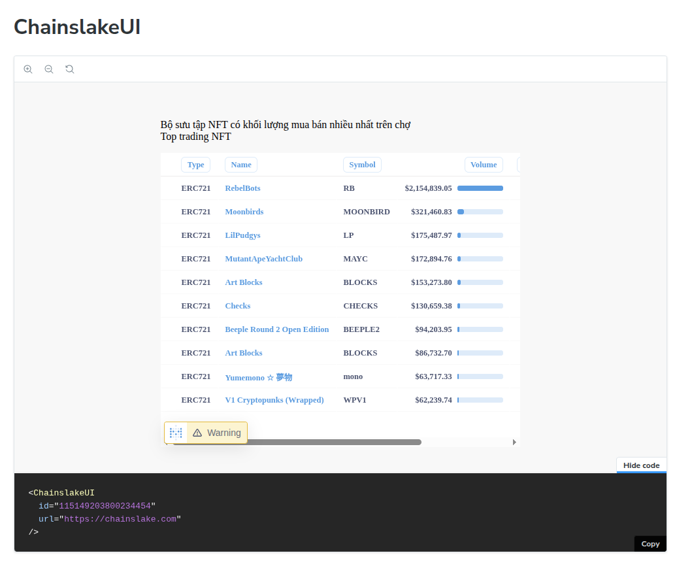
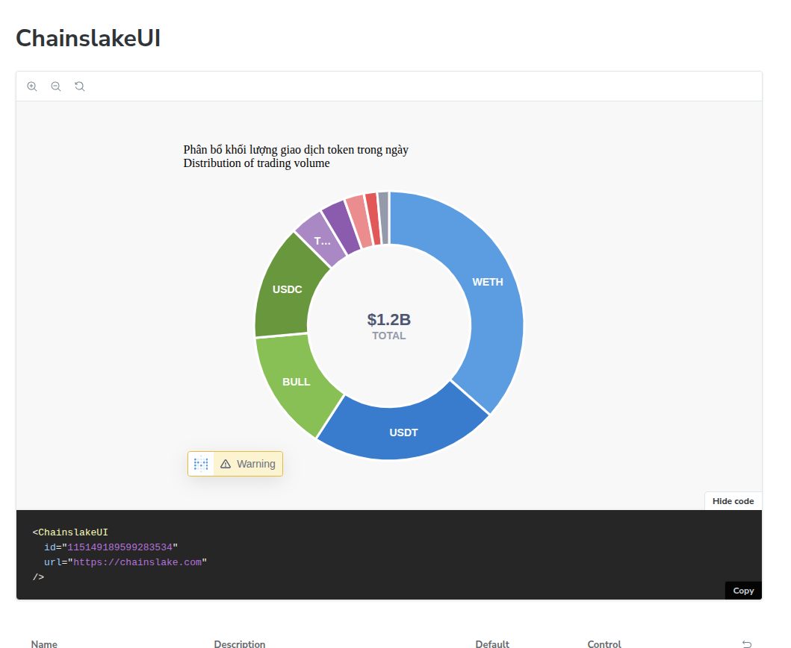
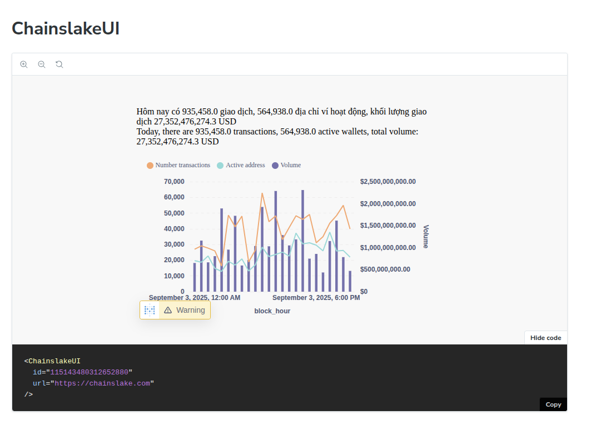

# Chainslake SDK

This is SDK for [Chainslake.com](https://chainslake.com) helps you quickly integrate status charts into your website.

## Install

`npm install chainslake`

## How to use


```typescript

import { ChainslakeContainer, ChainslakeStatus } from "chainslake"

function App() {

  return (
    <>
      <ChainslakeContainer url="https://chainslake.com">
        <ChainslakeStatus id="115149203800234454"></ChainslakeStatus>
        <ChainslakeStatus id="115149189599283534"></ChainslakeStatus>
        <ChainslakeStatus id="115143480312652880"></ChainslakeStatus>
      </ChainslakeContainer>
      
    </>
  )
}

export default App

```

## Screenshots







## License

MIT
